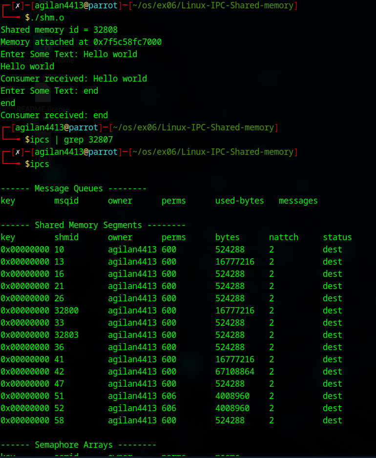

# Linux-IPC-Shared-memory
Ex06-Linux IPC-Shared-memory

# AIM:
To Write a C program that illustrates two processes communicating using shared memory.

# DESIGN STEPS:

### Step 1:

Navigate to any Linux environment installed on the system or installed inside a virtual environment like virtual box/vmware or online linux JSLinux (https://bellard.org/jslinux/vm.html?url=alpine-x86.cfg&mem=192) or docker.

### Step 2:

Write the C Program using Linux Process API - Shared Memory

### Step 3:

Execute the C Program for the desired output. 

# PROGRAM:

## Write a C program that illustrates two processes communicating using shared memory.

```c
#include <stdio.h>
#include <stdlib.h>
#include <string.h>
#include <unistd.h>
#include <sys/shm.h>
#include <sys/types.h>
#include <sys/wait.h>

#define TEXT_SZ 2048  // Shared memory size

struct shared_use_st {
    int written;  
    char some_text[TEXT_SZ];
};

int main() {
    int shmid;
    void *shared_memory = (void *)0;
    struct shared_use_st *shared_stuff;

    // Create shared memory
    shmid = shmget((key_t)1234, sizeof(struct shared_use_st), 0666 | IPC_CREAT);
    if (shmid == -1) {
        fprintf(stderr, "shmget failed\n");
        exit(EXIT_FAILURE);
    }
    
    // Print the shared memory ID in a predictable format
    printf("Shared memory id = %d\n", shmid);
    
    // Attach to shared memory
    shared_memory = shmat(shmid, (void *)0, 0);
    if (shared_memory == (void *)-1) {
        fprintf(stderr, "shmat failed\n");
        exit(EXIT_FAILURE);
    }
    printf("Memory attached at %p\n", shared_memory);
    
    shared_stuff = (struct shared_use_st *)shared_memory;
    shared_stuff->written = 0;

    pid_t pid = fork();
    
    if (pid < 0) {
        fprintf(stderr, "Fork failed\n");
        exit(EXIT_FAILURE);
    }

    if (pid == 0) {  // Child process (Consumer)
        while (1) {
            while (shared_stuff->written == 0) {
                sleep(1); // Wait for producer
            }

            printf("Consumer received: %s", shared_stuff->some_text);

            if (strncmp(shared_stuff->some_text, "end", 3) == 0) {
                break;
            }

            shared_stuff->written = 0; // Reset for producer
        }

        // Detach shared memory
        if (shmdt(shared_memory) == -1) {
            fprintf(stderr, "shmdt failed\n");
            exit(EXIT_FAILURE);
        }
        exit(EXIT_SUCCESS);
    } else {  // Parent process (Producer)
        char buffer[TEXT_SZ];

        while (1) {
            printf("Enter Some Text: ");
            fgets(buffer, TEXT_SZ, stdin);

            strncpy(shared_stuff->some_text, buffer, TEXT_SZ);
            shared_stuff->written = 1;
            printf(shared_stuff->some_text);

            if (strncmp(buffer, "end", 3) == 0) {
                break;
            }

            while (shared_stuff->written == 1) {
                sleep(1); // Wait for consumer
            }
        }

        // Wait for child process (consumer) to finish
        wait(NULL);

        // Detach and remove shared memory
        if (shmdt(shared_memory) == -1) {
            fprintf(stderr, "shmdt failed\n");
            exit(EXIT_FAILURE);
        }
        
        if (shmctl(shmid, IPC_RMID, 0) == -1) {
            fprintf(stderr, "shmctl failed\n");
            exit(EXIT_FAILURE);
        }

        exit(EXIT_SUCCESS);
    }
}
```


## OUTPUT


# RESULT:
The program is executed successfully.
